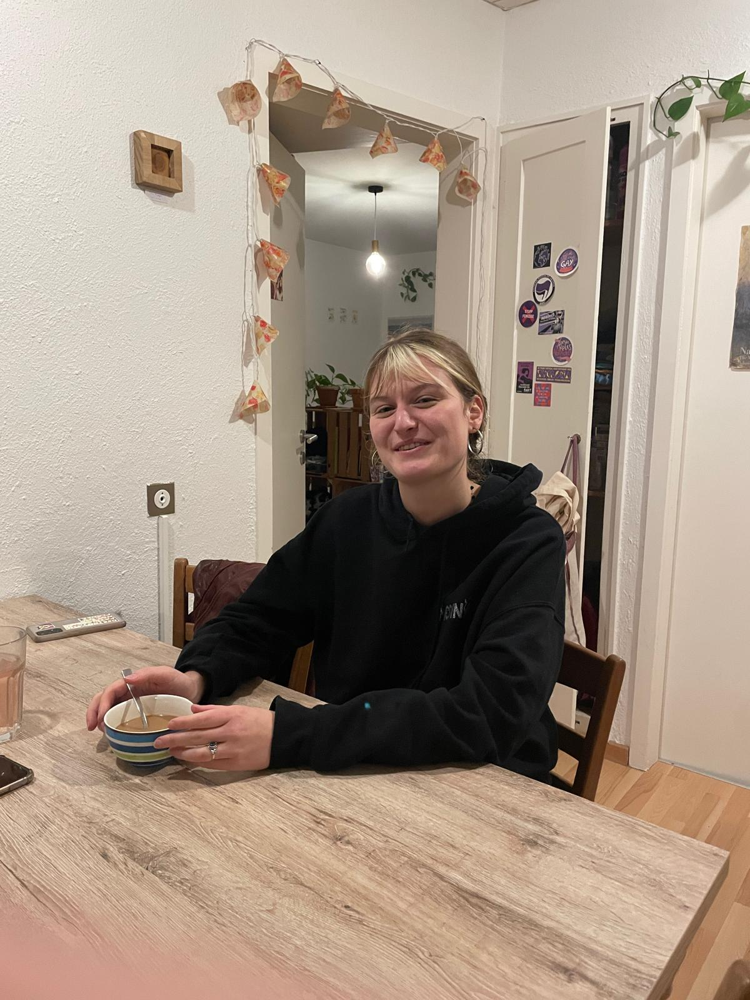

+++
title = "Für eine Welt, in die viele Welten passen!"
date = "2025-02-11"
draft = false
pinned = false
image = "whatsapp-bild-2025-01-29-um-15.19.19_8a6f7e1f.jpg"
description = ""
footnotes = ""
+++


Die Menschen am Rande der Gesellschaft treffen sich hier. Das Medina zeigt uns, mit ihrer Arbeit, einen Weg zu einer solidarischen Gesellschaft.



`Enya Sauser und Juli Hofstetter`

Wir sitzen zusammen an einem kleinen Tisch in einer WG. Mit ihrer Tasse Kaffee in der Hand, erzählt uns Michèle Stauffer von ihrer gemeinnützigen Arbeit bei Medina. Michele ist schon länger politisch aktiv und setzt sich für und warum es zu Gewalt kommen kann und was dies für einen Zusammenhang mit Sucht, Armut und Unterdrückung zu tun hat.

#### **Wie kamst du auf die Idee, beim Medina zu arbeiten?**

Ich sah auf Instagram einen Aufruf und da ich Soziale Arbeit studiere, wusste ich schon, dass ich etwas in diese Richtung machen möchte. Ich hatte auch Lust auf etwas Neues und gerade genug Zeit, daraufhin habe ich mich gemeldet und wurde eingearbeitet. 

#### **Was sind deine Hauptaufgaben bei deiner Tätigkeit?**

Im Kollektiv werden die Aufgaben nicht gross Aufgeteilt. Es gibt aber zwei verschiedene Gruppen; Container Gruppe (mit den Menschen vor Ort) und Büro Gruppe (Zuständig für Spenden, Fundraising etc.) Ich bin in der Container Gruppe, aber es gibt auch Menschen, die beides machen. 

#### **Was gefällt dir am meisten an deiner Arbeit? Was gibt es für  Herausforderungen?**

Für mich ist das Schönste mit den Menschen zu sein und ich glaube es tut mir auch gut, einfach draussen zu sein. Viele Menschen haben eine traurige Geschichte, für sie ist ein Ort wie dieser besonders wichtig. Es ist schön, in dieser Geschichte ein guter Teil zu sein. Repression ist aber der schlimmste Teil, also wenn Menschen vom Platz mitgenommen werden und auch unsere Arbeit behindert wird. Gewalt unter den Menschen ist schlimm anzusehen, aber mehr nachzuvollziehen als die Gewalt der Polizei. 

#### **Gibt es auch Gewalt im Rahmen des Medinas oder nur auf dem Vorplatz?**

Bei uns gibt es manchmal auch Gewalt, aber meistens kleinere Auseinandersetzungen und diese auch nicht gegen Mitglieder des Kollektivs. Ich finde es sehr wichtig, zu sagen, dass nicht “weisse Schweizerinnen" von der Gewalt betroffen sind, sondern marginalisierte und rassifizierte Personen und oft auch Menschen mit Suchterkrankungen. Dass körperlich etwas Schlimmes passiert, kommt sehr selten vor.

> “Ich fühle mich auf der Schützenmatte sicher.”
>
> \-Michèle Stauffer

#### **Gibt es Erlebnisse, die dir besonders in Erinnerung geblieben sind?**

Meine allererste Schicht war am “Nouruz”, einem Kurdischen Neujahrsfest im Frühling. Dort gab es richtig viel kurdisches Essen und Baklava für alle, das war sehr schön. Aber sonst bleibt von den schönen Momenten eher ein Gefühl und von den schwierigen Momenten ist die Erinnerung viel konkreter. Wir haben zum Beispiel einmal ein fünf Jahres Jubiläum, mit allen aus dem Kollektiv und vom Platz, gefeiert und da wurde mittendrin jemand von der Polizei festgenommen. Alle haben dann Angst bekommen und sind davon gegangen. Diese Person war dann sieben Monate im Gefängnis und das nur weil sie das Geld nicht hatte, um  Bussen zu bezahlen. Da bin ich “auf die Welt gekommen “ einerseits, wie schlimm und grausam das System ist und wie fest innerhalb dieses Systems dann noch gegen die Gesetze verstoßen wird. 

#### **Wo sind die Grenzen eurer Arbeit?**

Bei Medina verschwimmt die Soziale Arbeit häufig mit Freundschaft, was bei uns  auch die Idee ist, aber dieses Konzept ist sehr anders als an anderen Orten. Wir können bedingungslos da sein, weil wir ja keinen Leistungsauftrag haben. Es ist also mehr die Frage, ob etwas sinnvoll ist, also ob wir etwas tun dürfen. Finanziell können wir nicht helfen, weil wir haben nur ein kleines Budget haben. Wir bezahlen zum Beispiel auch keine Bussen, obwohl wir anerkennen, dass sie oft ungerecht sind, aber wir können sie  einfach nicht übernehmen. Auch Sachen, mit denen man beim System an die Grenzen stösst, können wir nicht helfen, also zum Beispiel mit Sans-Papiers sehr schnell. Was ich gelernt habe, ist dass es meistens einen Weg für das Problem gibt, weil diese Menschen sind Überlebenskünstler*innen und es lässt sich immer einen Weg für den Moment finden.

#### **Habt ihr Fachpersonen für Beratungen im Medina ?**

Wir leiten viel weiter an andere Institutionen weiter, was aber auch ein Problem ist, weil alle zu wenig Kapazitäten haben und viele Menschen dann im Kreis herumgegeben werden. Wir arbeiten auch mit einem Sprachzentrum zusammen, wo wir Menschen in Sprachkurse schicken, die wir auch für sie bezahlen. Wir sind auch gerade am diskutieren, ob wir auf dem Platz einen Sprachkurs anbieten wollen. Sonst gibt es an Fachpersonen einfach viele Menschen mit einer hilfreichen Ausbildung, wie Sozialarbeiter*innen oder Lehrkräfte. Eine solche Ausbildung ist aber keine Voraussetzung, um im Medina zu arbeiten.

#### **Wie hast du die aktuelle Lage erlebt?**

Ich fand nicht, dass es mehr Gewalt gibt als sonst. Es hat ab und zu vereinzelte, schlimmere Vorfälle gegeben, aber diese Ausbrüche sind dann auch immer wieder abgeflacht. Es wurden einfach mehr Menschen in Gewahrsam genommen und man konnte die Gewalt mehr nachweisen. Für uns war das schwierigste, dass die Reitschule geschlossen hatte, weil wenn die Reitschule offen ist kommen mehr Menschen und wenn der Platz belebt ist, passiert einfach auch weniger.  Ich fühle mich auf der Schützenmatte sicherer als an vielen anderen Orten, weil ich weiss, dass Menschen da sind, die ich kenne, falls etwas passiert.

#### **Welche Unterstützungen/ Massnahmen würdest du dir von der Stadt Bern wünschen?**

Wir haben mit der Reitschule und der Gassenarbeit einen Maßnahmenkatalog ausgearbeitet. Dort steht zum Beispiel, dass es einen “Dealer Corner” geben sollte, wo man sicher Dealen kann, weil Repressionen offensichtlich nichts bringen. Ich denke nicht, dass die Stadt Bern die Situation gut handhabt, aber man muss auch sagen, dass sie sehr eingeschränkt in ihrer Handlungsmacht sind. Ich würde mir aber auch die Entkriminalisierung von sehr vielen Sachen wünschen.



Das Medina ist ein Gemeinschaftszentrum, welches sich auf der Schützenmatte in Bern befindet. Es ist für Menschen, die am Rande der Gesellschaft leben und dient ihnen, als Treffpunkt und Anlaufstelle und um Kontakte zu knüpfen. Jeden Donnerstag und Freitag Abend kann man dort kostenlos von 18:00 bis 22:00 zusammen kochen und essen. Das Medina verfolgt keine kommerziellen Zwecke und es ist nicht gewinnorientiert. Es hat 2020 den Sozialpreis der Stadt Bern gewonnen.

